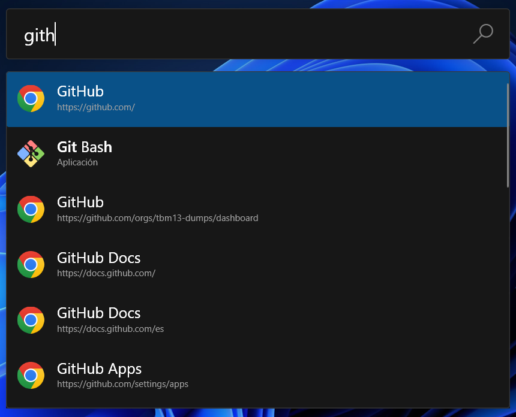

# BrowserSearch
This is a plugin for PowerToys Run.
It reads your default browser's history, allowing you to search its entries and open their URL.

    

## Supported browsers
* Arc
* Brave
* Cent Browser
* Chromium
* Firefox
* Google Chrome
* LibreWolf
* Microsoft Edge (Chromium version)
* Naver Whale
* Opera
* Opera GX (profile selection not supported)
* Thorium
* Ungoogled Chromium
* Vivaldi Browser
* Waterfox
* Wavebox
* Zen Browser

Support for any other browser based on Chromium or Firefox can be added easily. If yours is not listed here, open an issue.

**NOTE**: Some browsers share the same ID. For example, if you have both Opera and Opera Developer installed, only the history of Opera will be loaded no matter which one of them is set as the default browser since we can't differentiate them by their ID.

## Install instructions
* Exit PowerToys
* Download latest version from [releases](https://github.com/TBM13/BrowserSearch/releases)
* Extract zip
* Move extracted folder `BrowserSearch` to `%LOCALAPPDATA%\Microsoft\PowerToys\PowerToys Run\Plugins\`
* Start PowerToys

## Build instructions
* Clone this repo
* Inside the `BrowserSearch` folder, create another one called `libs`
* Copy the following files from `%ProgramFiles%\PowerToys\` to `libs`
    * Wox.Plugin.dll
    * Wox.Infrastructure.dll
    * Microsoft.Data.Sqlite.dll
    * PowerToys.Settings.UI.Lib.dll
* Now you have two options:
  * To make a debug build, open the project in Visual Studio, build it and copy the output folder `BrowserSearch\bin\Debug` to `%LOCALAPPDATA%\Microsoft\PowerToys\PowerToys Run\Plugins\`.
  * To make a release build, use the `publish.ps1` script.
    * This will output all the necessary files to the `PublishOutput` folder.
    * The plugin will automatically be copied to `%LOCALAPPDATA%\Microsoft\PowerToys\PowerToys Run\Plugins\BrowserSearch\`